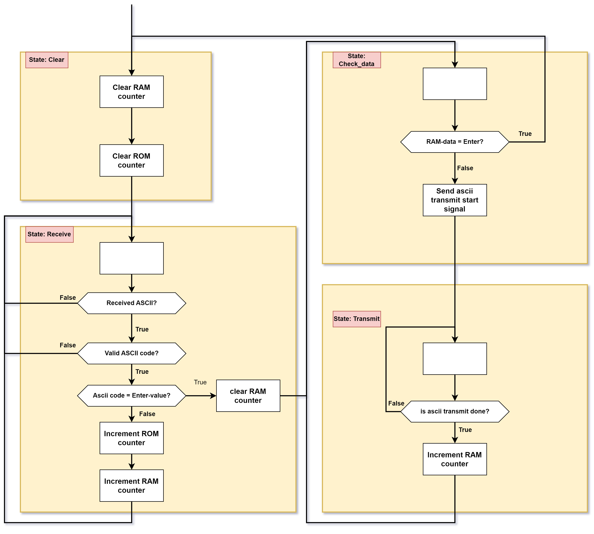
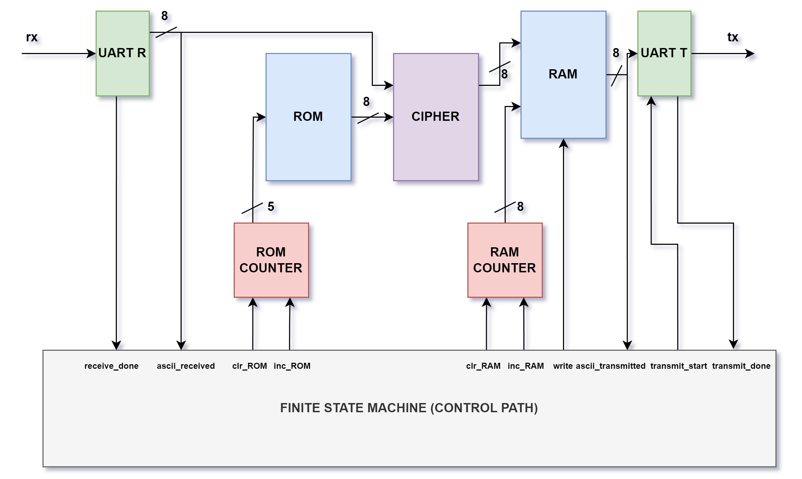

# Napoleon Cipher

## Our Group
- Hannes Weigel
- Christopher Karl Omar Daffinrud
- Shahin Kamil Ostadahmadi
- Aditi Ravi Deshpande
- Oscar Melby
- Ole Eirik Solberg Seljordslia

## Our Assignment
We wanted to create a Napoleon cipher encoder/decoder using the key "joseferreiraportugal".
We want to be able to test this by sending in ascii-values for characters (aditi) ending with the Enter-value. The output should be a decoded message, and again we should be able to test vice versa. Sending in ascii-values that the output shows to be able to provide the original sentence.

## Our Solution
We created two diagrams: FSM Diagram and ASM Diagram.

 We structured the following entities among us:

- Finite State Machine (Control Path) and FSM/ASM Diagrams - Christopher
- UART Receive and UART Tranmit  - Ole
- ROM and ROM-counter - Aditi
- RAM and counter - Hannes
- Cipher Function - Shahin
- Top Module - Oscar

## Our Result
After everyone had contributed with their solution for their allocated entity, we sat together adding them into our project and tried to simulate.
We got errors on the output where they were undefined. We see that our testbench send aditi-characters followed by enter. 